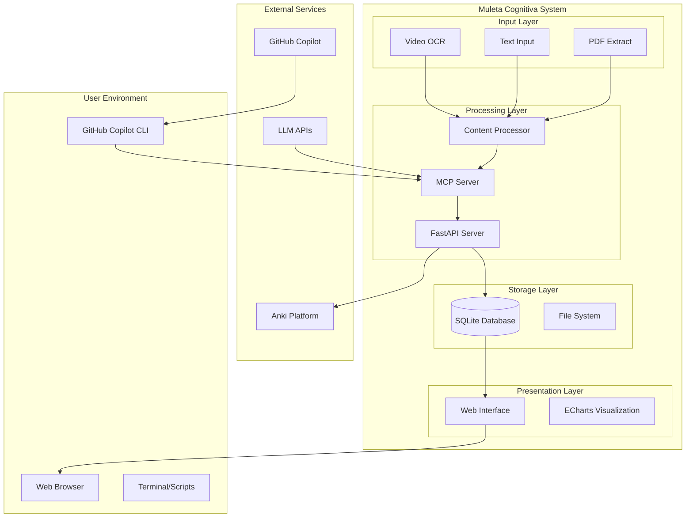

# Arquitetura do Sistema

## Resumo Arquitetural
Stack: Python/SQLite/FastAPI + HTML/ECharts + MCP Server
Escopo: Sistema local de aprendizado pessoal com integração LLM
Restrições: Processamento local, privacidade de dados, performance single-user

## Contexto do Sistema

## Principais Componentes

### 1. MCP Server (Model Context Protocol)
**Responsabilidade**: Ponte entre LLMs e dados locais
- **Interfaces**: MCP Protocol, REST API endpoints
- **Dependências**: SQLite Database, Content Processors
- **Fluxo**: Recebe contexto → Processa via LLM → Persiste resultados
- **Exemplo de Uso**: `mcp.process_content(text) → entities + relations`

### 2. Content Processing Pipeline
**Responsabilidade**: Extração e estruturação de conhecimento
- **Interfaces**: OCR Scripts, Text Processors, LLM Integration
- **Dependências**: Tesseract, ImageMagick, FFmpeg
- **Fluxo**: Raw Content → OCR → LLM Analysis → Structured Data
- **Exemplo de Uso**: `video_to_text.sh → text → entity_extraction → database`

### 3. Knowledge Graph Database
**Responsabilidade**: Armazenamento estruturado e consultas
- **Interfaces**: SQLite Schema, Query APIs
- **Dependências**: Nenhuma (SQLite embedded)
- **Fluxo**: Structured Data → Normalization → Storage → Retrieval
- **Exemplo de Uso**: `entities + relations → graph queries → visualization data`

### 4. Web Visualization Interface
**Responsabilidade**: Apresentação interativa do conhecimento
- **Interfaces**: HTML/JS, ECharts, REST API calls
- **Dependências**: Modern Web Browser, FastAPI Server
- **Fluxo**: User Interaction → API Calls → Data Rendering → Visual Updates
- **Exemplo de Uso**: `graph_type_change → fetch_data → render_chart → user_interaction`

### 5. Learning Tools Suite
**Responsabilidade**: Sistemas de estudo e avaliação
- **Interfaces**: Spaced Repetition, Assessment Generator, Export APIs
- **Dependências**: LLM APIs, Knowledge Graph
- **Fluxo**: Entity Selection → Card Generation → Review Tracking → Performance Analysis
- **Exemplo de Uso**: `select_entities → generate_cards → schedule_reviews → export_anki`

## Fluxos de Dados e Eventos

### Fluxo Principal de Ingestão
1. **Input**: Usuário fornece conteúdo (vídeo/texto/PDF)
2. **Processing**: OCR + LLM extraction de entidades/relações
3. **Storage**: Dados estruturados persistidos no SQLite
4. **Notification**: Web interface atualizada automaticamente
5. **Integration**: Dados disponíveis para ferramentas de estudo

### Fluxo de Aprendizado
1. **Schedule**: Sistema calcula cards devido (spaced repetition)
2. **Presentation**: Cards apresentados via web ou export Anki
3. **Response**: Usuário responde e avalia dificuldade
4. **Adaptation**: Algoritmo ajusta próximos intervalos
5. **Analytics**: Performance tracking para identificar gaps

### Fluxo de Desenvolvimento (GitHub Copilot)
1. **Context**: MCP Server fornece contexto do projeto
2. **Query**: Desenvolvedor faz pergunta via Copilot CLI
3. **Analysis**: Copilot analisa código + documentação + dados
4. **Response**: Sugestões contextualizadas baseadas no projeto
5. **Implementation**: Código gerado com conhecimento específico

## Integrações Externas

### LLM APIs
- **Purpose**: Processamento de linguagem natural
- **Protocol**: REST/HTTP
- **Data Flow**: text_input → structured_output
- **Error Handling**: Retry logic, fallback models

### Anki Integration
- **Purpose**: Spaced repetition export
- **Protocol**: .apkg files / AnkiConnect API
- **Data Flow**: cards_data → anki_format → sync
- **Error Handling**: Format validation, connection timeout

### GitHub Copilot
- **Purpose**: Development assistance
- **Protocol**: MCP over stdio
- **Data Flow**: code_context → suggestions → implementations
- **Error Handling**: Graceful degradation without context

## Decisões Arquiteturais e Trade-offs

### SQLite vs PostgreSQL
**Decisão**: SQLite
**Razão**: Single-user, local deployment, zero configuration
**Trade-off**: Escalabilidade limitada vs simplicidade operacional

### Monolithic vs Microservices
**Decisão**: Monolithic MCP Server
**Razão**: Baixa complexidade operacional, desenvolvimento mais rápido
**Trade-off**: Flexibilidade limitada vs facilidade de manutenção

### Local vs Cloud Processing
**Decisão**: Processamento local com APIs LLM externas
**Razão**: Privacidade de dados, controle total
**Trade-off**: Dependência de internet vs segurança de dados

### ECharts vs D3.js
**Decisão**: ECharts
**Razão**: APIs mais simples, menos código customizado
**Trade-off**: Customização limitada vs produtividade

## Riscos e Mitigações

### Performance com Grafos Grandes
**Risco**: Lentidão na visualização com muitas entidades
**Mitigação**: Paginação, lazy loading, filtros inteligentes

### Dependência de LLM APIs
**Risco**: Indisponibilidade ou mudanças nas APIs
**Mitigação**: Múltiplos provedores, cache local, mode offline

### Integridade dos Dados
**Risco**: Corrupção ou perda de dados SQLite
**Mitigação**: Backups automáticos, validação de schema, logging

### Complexidade do Código MCP
**Risco**: Manutenção difícil do servidor MCP
**Mitigação**: Testes abrangentes, documentação detalhada, modularização

## Limites e Restrições

### Boundaries Técnicos
- **Não ultrapasse**: Processamento de dados em paralelo complexo
- **Respeite**: Single-threaded SQLite operations
- **Evite**: Heavy computation no thread principal

### Layering Rules
- **UI Layer**: Apenas visualização, sem lógica de negócio
- **API Layer**: Stateless, apenas coordenação
- **Business Layer**: Toda lógica no MCP Server
- **Data Layer**: Apenas persistência, sem processamento

### Performance-Sensitive Areas
- **Visualization Rendering**: Limite de 1000 nós simultâneos
- **LLM API Calls**: Rate limiting e timeouts apropriados
- **File Processing**: Streaming para arquivos grandes
- **Database Queries**: Índices obrigatórios em foreign keys