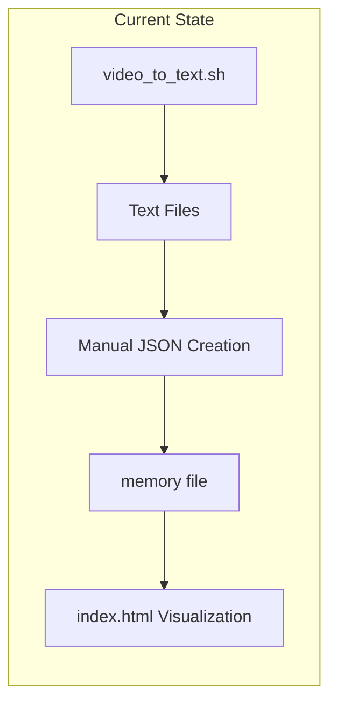
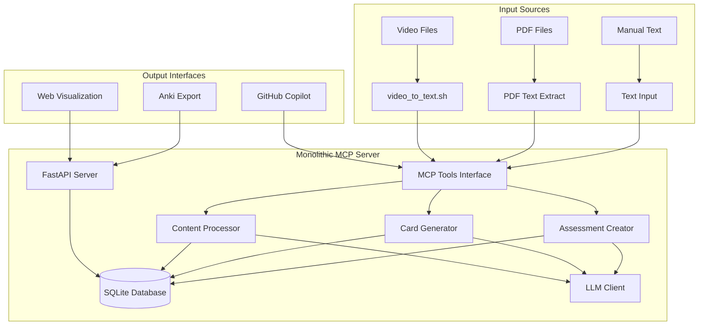
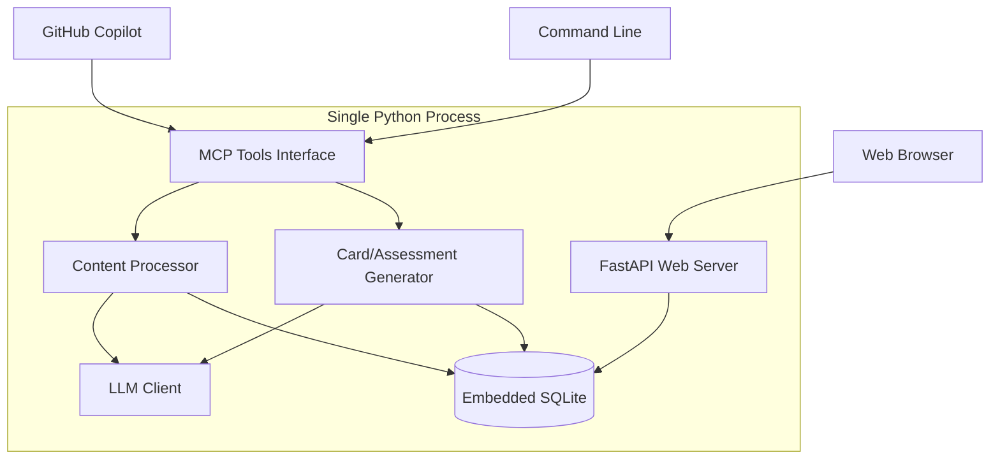

# Monolithic MCP Server Implementation for Grafo Filosófico Personal Learning System

**JIRA/Task Reference**: [TODO: Add task ID]

## Summary

Implementation of a simple, monolithic Model Context Protocol (MCP) server to transform the current Grafo Filosófico knowledge graph visualization into a comprehensive personal learning system. The MCP server provides LLM-powered content processing, automated knowledge extraction, spaced repetition card generation, and assessment creation using a single Python process with embedded SQLite database. This approach prioritizes simplicity, local operation, and ease of maintenance while delivering all core learning features.

## Goals, Non-Goals, and Scope

### Goals
1. Implement simple monolithic MCP server with embedded SQLite database
2. Automate content processing pipeline for video OCR, PDF, and text inputs
3. Create spaced repetition system with Anki integration
4. Generate Socratic questioning and assessment tools
5. Maintain existing web visualization with direct database integration
6. Provide local LLM processing with zero external dependencies

### Non-Goals
1. Distributed architecture or microservices complexity
2. Cloud-based processing or external database requirements
3. Real-time collaborative features or multi-user support
4. Advanced infrastructure or container orchestration

### In-Scope
- Single Python process MCP server with FastAPI
- Embedded SQLite database with WAL mode
- Direct LLM integration (OpenAI API or local models)
- Simple web interface updates for database integration
- Local spaced repetition and assessment generation
- Anki export functionality

### Out-of-Scope
- Background job queues or distributed processing
- External services integration beyond LLM APIs
- Complex deployment or infrastructure requirements
- Multi-language support beyond Portuguese/English

## Context and Assumptions

### Current Architecture



### Target Architecture



### Key Assumptions
- User has Python 3.9+ environment with pip/virtual environments
- Local LLM access (OpenAI API key or local model like Ollama)
- SQLite sufficient for personal knowledge scale (< 50k entities)
- Single-user operation with no concurrent access requirements
- Current video_to_text.sh script integration maintained
- Simple deployment preferred over complex infrastructure

### Existing Data Models Affected
- Current JSONL memory file format migrated to SQLite tables
- Web visualization updated to use FastAPI endpoints instead of file reading
- OCR output processing integrated directly into MCP tools

## Requirements

### Functional Requirements

**FR-1: Content Processing Pipeline**
- Given a text source (OCR output, PDF extract, or manual input)
- When processed through MCP server
- Then system extracts entities, relationships, and observations
- And stores structured data in SQLite database
- And maintains source attribution and timestamps

**FR-2: Knowledge Graph Database**
- Given structured knowledge data
- When stored in SQLite database
- Then system maintains entities table with (id, name, type, metadata)
- And relations table with (id, from_entity, to_entity, type, confidence)
- And observations table with (id, entity_id, content, source, timestamp)
- And supports efficient querying for visualization and analysis

**FR-3: Sistema de Revisão Espaçada Integrado**
- Given entities in the knowledge base
- When user requests spaced repetition cards
- Then system generates cards with multiple types (definition, socratic, relation, application)
- And applies Ebbinghaus forgetting curve algorithm for scheduling
- And tracks review performance and adjusts intervals dynamically
- And integrates Socratic questioning within cards
- And exports to Anki-compatible formats
- And provides due card notifications and statistics

**FR-4: Questões Socráticas Integradas**
- Given entity or relationship context
- When user requests Socratic questioning
- Then system generates contextual questions like:
  - "Por que X é importante para Y?"
  - "Que evidências sustentam a ideia de X?"
  - "Como X se relaciona com Y e Z?"
  - "Quais as implicações práticas de X?"
  - "Que objeções alguém poderia fazer contra X?"
- And integrates these questions into spaced repetition cards
- And provides progressive difficulty levels
- And tracks understanding progression over time

**FR-5: Fluxogramas de Argumentação (ECharts)**
- Given a set of related entities and their relationships
- When user requests argument sequence visualization
- Then system creates interactive flowcharts showing:
  - Premises, inferences, and conclusions
  - Evidence supporting each claim
  - Objections and counter-arguments
  - Logical flow between concepts
- And renders using ECharts flowchart format
- And allows interactive editing of nodes and connections
- And supports different argument visualization styles
- And exports diagrams in multiple formats

**FR-6: Sistema de Avaliações Completo**
- Given topic selection and parameters
- When user requests assessment creation
- Then system generates comprehensive evaluations with:
  - Multiple choice questions with distractors
  - Short answer questions
  - Essay questions with evaluation criteria
  - True/false questions with explanations
- And provides automated scoring for objective questions
- And offers detailed feedback on knowledge gaps
- And identifies weak areas for targeted study
- And suggests specific entities/relations for review
- And tracks performance over time

**FR-7: Análise de Gaps de Conhecimento**
- Given assessment results and card review performance
- When system analyzes learning patterns
- Then identifies knowledge gaps and weak areas
- And provides specific recommendations for improvement
- And suggests targeted study sessions
- And tracks gap resolution over time
- And integrates findings into future card generation

**FR-8: Web Visualization Integration Avançada**
- Given SQLite database state with all features
- When user accesses web interface
- Then system displays:
  - Interactive knowledge graph with enhanced metadata
  - Argument sequence flowcharts using ECharts
  - Spaced repetition card statistics and due notifications
  - Knowledge gap visualizations and weak area highlights
- And maintains existing visualization features (force/circular layouts)
- And provides real-time updates from database
- And supports advanced filtering by card performance, argument sequences, and assessment results

## Architecture Options

### Option A: Monolithic MCP Server with Embedded SQLite (SELECTED)

**Overview and Components**



**Detailed Description**
- **Backend/Services**: Single Python process using FastAPI framework with integrated MCP server, embedded SQLite database with WAL mode for concurrent reads
- **API Changes**: Simple REST endpoints for visualization data, content upload, and export functions
- **Data Model**: SQLite schema with entities, relations, observations, cards, assessments tables with proper indexing
- **Frontend Changes**: Update index.html to fetch data from localhost API instead of memory file, add simple upload form
- **Infrastructure**: Local deployment only, systemd service or simple startup script, no external dependencies
- **Migration**: Single Python script to convert existing memory JSONL to SQLite schema with validation
- **Observability**: Python logging to files, simple health check endpoint, basic metrics collection

**Trade-offs**
- **Pros**: Extremely simple deployment, zero infrastructure complexity, fast local queries, no network latency, easy debugging, familiar Python ecosystem
- **Cons**: Single point of failure, limited to one concurrent user, SQLite size limitations (~280TB theoretical, ~50K entities practical)
- **Complexity**: Very Low - single codebase, standard libraries, no orchestration
- **Maintainability**: Excellent - one process to manage, familiar tools, straightforward debugging
- **Risk**: Very Low - proven technology stack, minimal moving parts, easy rollback
- **Developer Velocity**: Highest - rapid development, immediate testing, simple deployment
- **Time-to-Market**: Fastest - 3-4 weeks for full implementation
- **Cost**: Minimal - only LLM API usage costs, no infrastructure

**Feasibility**: Perfect fit for single-user personal learning system, leverages existing tools
**Risks**: LLM API rate limits (mitigated with local model fallback), SQLite performance with very large datasets (unlikely for personal use)
**Mitigations**: Request queuing for LLM calls, database optimization, query result caching
**Effort**: Small (S) - 3-4 weeks total
**Timeline**: MVP in 2 weeks, full features in 4 weeks

## Architecture Decision

**Selected Option: A - Monolithic MCP Server with Embedded SQLite**

**Rationale**: This option perfectly aligns with the project's goals of simplicity and local operation. The monolithic architecture eliminates infrastructure complexity while providing all necessary features for personal learning. The embedded SQLite database is ideal for single-user scenarios and provides excellent performance for personal-scale knowledge graphs. The MCP integration enables seamless GitHub Copilot workflows while maintaining the simplicity users desire.

**Decision Confidence**: Very High - aligns perfectly with requirements, proven technology stack, minimal operational overhead

## High-Level Implementation Plan

### Phase 1: Foundation Setup (Weeks 1-2)

**Step 1: Project Structure and Environment Setup**
- Objective: Create project structure with proper Python packaging and dependencies
- Create a folder called api 
- Code/Config Changes: Create `pyproject.toml`, `api/`, virtual environment setup with uv
- Acceptance Check: Project structure follows Python standards, all dependencies install correctly

**Copilot sub-prompt:**
- Context: `/Users/davisimite/Documents/muleta-cognitiva`, Python monolithic MCP server project
- Task: Set up Python project structure with pyproject.toml, src layout, and development dependencies
- Tests: Basic import tests, project structure validation

**Step 2: SQLite Database Schema and Migration**
- Objective: Create SQLite database schema and migrate existing memory data
- Code/Config Changes: Create `api/database.py`, `api/scripts/migrate_memory.py`
- Tests: Database connection tests, migration validation, schema integrity checks
- Acceptance Check: Existing memory data successfully migrated with full data integrity

**Copilot sub-prompt:**
- Task: Create SQLite schema for entities/relations/observations and migration script from JSONL
- Edits: Create database.py with schema, migrate_memory.py script, SQL DDL statements
- Tests: Database creation tests, migration validation, data integrity checks
- Done when: Migration script converts existing memory file to SQLite without data loss

### Phase 2: MCP Server Core (Weeks 2-3)

**Step 3: Basic MCP Server Implementation**
- Objective: Implement MCP server with core protocol handling and tool registration
- Code/Config Changes: Create `api/mcp_server.py`, tool definitions
- Tests: MCP protocol compliance tests, tool registration tests, basic communication tests
- Acceptance Check: MCP server accepts connections and responds to tool discovery

**Copilot sub-prompt:**
- Task: Create MCP server with basic protocol handling and empty tool registration
- Edits: Create mcp_server.py, implement MCP protocol handlers, tool registry
- Tests: MCP connection tests, protocol compliance validation
- Done when: MCP server starts successfully and GitHub Copilot can connect

**Step 4: LLM Integration and Content Processing**
- Objective: Implement LLM client and content processing pipeline with entity extraction
- Code/Config Changes: Create `src/api/llm_client.py`, `content_processor.py`
- Tests: LLM API integration tests, content parsing tests, entity extraction validation
- Acceptance Check: Text content processed into structured entities and relationships in database

**Copilot sub-prompt:**
- Context: `/Users/davisimite/Documents/muleta-cognitiva`, OpenAI API integration, entity extraction
- Task: Implement LLM client and content processor for automatic entity/relationship extraction
- Edits: Create llm_client.py, content_processor.py, environment variable handling
- Tests: LLM API tests, content processing validation, database integration tests
- Done when: Text input results in structured entities and relations stored in SQLite

### Phase 3: Web Interface and API (Week 3)

**Step 5: FastAPI Server and Database Integration**
- Objective: Create simple REST API for web visualization and data access
- Code/Config Changes: Create `src/api/api.py`, endpoint definitions
- Tests: API endpoint tests, database query tests, JSON response validation
- Acceptance Check: API serves visualization data and basic CRUD operations work

**Copilot sub-prompt:**
- Context: `/Users/davisimite/Documents/muleta-cognitiva`, FastAPI, SQLite integration
- Task: Create REST API with endpoints for entities, relations, visualization data
- Edits: Create api.py with FastAPI app, define routes, database integration
- Tests: API endpoint tests, response validation, database query tests
- Done when: API serves data correctly and supports basic entity/relation operations

**Step 6: Web Interface com Visualizações Avançadas**
- Objective: Update web visualization to support all features including flowcharts and learning analytics
- Code/Config Changes: Modify `index.html` to support argument flowcharts, card statistics, assessment results
- Tests: Web interface loading tests, flowchart rendering tests, learning analytics display tests
- Acceptance Check: Web visualization displays knowledge graph, argument flowcharts, and learning statistics

**Copilot sub-prompt:**
- Context: `/Users/davisimite/Documents/muleta-cognitiva`, existing index.html, ECharts integration, learning features
- Task: Enhance web visualization with argument flowcharts, card statistics, and assessment analytics
- Edits: Modify index.html to add flowchart views, learning dashboard, assessment results visualization
- Tests: Browser loading tests, flowchart rendering validation, learning metrics display
- Done when: Web interface displays all features including interactive flowcharts and learning analytics

### Phase 4: Learning Tools Implementation (Week 4)

**Step 7: Sistema de Revisão Espaçada Completo**
- Objective: Implement comprehensive spaced repetition system with Socratic questions integration
- Code/Config Changes: Create `src/api/spaced_repetition.py`, `card_generator.py`, `socratic_questions.py`
- Tests: Algorithm correctness tests, card generation tests, interval calculation validation, Socratic question quality tests
- Acceptance Check: System generates multiple card types with appropriate review intervals and integrates Socratic questions

**Copilot sub-prompt:**
- Context: `/Users/davisimite/Documents/muleta-cognitiva`, spaced repetition, Ebbinghaus curve, Socratic questioning
- Task: Implement complete spaced repetition system with multiple card types and integrated Socratic questions
- Edits: Create spaced_repetition.py, card_generator.py, socratic_questions.py, database tables for cards and reviews
- Tests: Algorithm tests, card generation validation, review scheduling tests, Socratic question integration
- Done when: Cards generated with correct intervals, multiple types, and high-quality Socratic questions

**Step 8: Fluxogramas Argumentativos e Sistema de Avaliações**
- Objective: Create argument sequence flowcharts and comprehensive assessment system
- Code/Config Changes: Create `argument_flowchart.py`, `assessment_creator.py`, `knowledge_analyzer.py`, `anki_exporter.py`
- Tests: Flowchart generation tests, assessment creation tests, knowledge gap analysis tests, Anki export validation
- Acceptance Check: System generates ECharts flowcharts, comprehensive assessments, and identifies knowledge gaps

**Copilot sub-prompt:**
- Context: `/Users/davisimite/Documents/muleta-cognitiva`, ECharts flowcharts, comprehensive assessments, knowledge analysis
- Task: Implement argument flowchart generation, assessment creation, knowledge gap analysis, and Anki export
- Edits: Create argument_flowchart.py, assessment_creator.py, knowledge_analyzer.py, anki_exporter.py
- Tests: Flowchart rendering tests, assessment generation validation, gap analysis accuracy, export format tests
- Done when: System generates interactive flowcharts, quality assessments, identifies gaps, and exports to Anki

## API and Data Contracts

### REST API Endpoints

```
# Entidades e Visualização
GET /api/entities
  Response: {entities: [{id, name, entity_type, description, created_at}]}
  
GET /api/entities/{id}
  Response: {entity: {id, name, type, description, observations: [], relations: []}}
  
GET /api/visualization
  Response: {nodes: [], links: [], categories: []} # Formato ECharts
  
POST /api/content/process
  Payload: {content: string, source_type: "text|pdf|video", source_path: string}
  Response: {success: true, entities_created: number, relations_created: number}

# Sistema de Revisão Espaçada
GET /api/cards/due
  Response: {cards: [{id, question, answer, card_type, entity_name}]}
  
POST /api/cards/generate
  Payload: {entity_ids: [int], card_types: ["definition", "socratic", "relation"]}
  Response: {cards_created: number, cards: [{id, question, answer, card_type}]}
  
POST /api/cards/{id}/review
  Payload: {quality: int, response_time: int}
  Response: {next_review_date: string, interval_days: int}

# Questões Socráticas
GET /api/questions/socratic/{entity_id}
  Response: {questions: [{type, question, context}]}
  
POST /api/questions/generate
  Payload: {entity_ids: [int], question_types: ["why_important", "evidence", "implications"]}
  Response: {questions: [{entity_id, question, type, suggested_answer}]}

# Fluxogramas Argumentativos
GET /api/arguments
  Response: {sequences: [{id, title, entity_count, created_at}]}
  
POST /api/arguments/create
  Payload: {title: string, entity_ids: [int], description: string}
  Response: {sequence_id: int, nodes_created: number}
  
GET /api/arguments/{id}
  Response: {sequence: {id, title, nodes: [], connections: []}}
  
PUT /api/arguments/{id}/nodes
  Payload: {nodes: [{content, node_type, position_x, position_y}]}
  Response: {nodes_updated: number}

# Avaliações e Provas
GET /api/assessments
  Response: {assessments: [{id, title, difficulty_level, question_count}]}
  
POST /api/assessments/create
  Payload: {title: string, entity_ids: [int], difficulty: int, question_types: []}
  Response: {assessment_id: int, questions_generated: number}
  
GET /api/assessments/{id}
  Response: {assessment: {id, title, questions: [], estimated_duration}}
  
POST /api/assessments/{id}/attempt
  Payload: {answers: [{question_id, answer}]}
  Response: {attempt_id: int, score: float, feedback: string, gaps: []}

# Análise de Conhecimento
GET /api/knowledge/gaps
  Response: {gaps: [{entity_name, gap_type, suggestion, confidence}]}
  
GET /api/knowledge/stats
  Response: {entities_count, cards_due, avg_success_rate, weak_areas: []}

# Exportação
GET /api/export/anki
  Query: ?entity_ids=1,2,3&card_types=definition,socratic
  Response: File download (.apkg format)
  
GET /api/export/assessment/{id}
  Response: File download (PDF format)
  
GET /api/health
  Response: {status: "ok", database: "connected", version: "1.0.0"}
```

### Database Schema

```sql
-- Entidades centrais
CREATE TABLE entities (
    id INTEGER PRIMARY KEY,
    name TEXT NOT NULL UNIQUE,
    entity_type TEXT,
    description TEXT,
    created_at TIMESTAMP DEFAULT CURRENT_TIMESTAMP,
    updated_at TIMESTAMP DEFAULT CURRENT_TIMESTAMP
);

-- Observações/notas sobre entidades
CREATE TABLE observations (
    id INTEGER PRIMARY KEY,
    entity_id INTEGER REFERENCES entities(id),
    content TEXT NOT NULL,
    source_type TEXT, -- 'video', 'text', 'manual'
    source_path TEXT, -- caminho para arquivo original
    confidence REAL DEFAULT 1.0,
    created_at TIMESTAMP DEFAULT CURRENT_TIMESTAMP
);

-- Relações entre entidades
CREATE TABLE relations (
    id INTEGER PRIMARY KEY,
    from_entity_id INTEGER REFERENCES entities(id),
    to_entity_id INTEGER REFERENCES entities(id),
    relation_type TEXT,
    strength REAL DEFAULT 1.0,
    evidence TEXT, -- justificativa da relação
    created_at TIMESTAMP DEFAULT CURRENT_TIMESTAMP
);

-- Sistema de revisão espaçada com questões socráticas integradas
CREATE TABLE spaced_repetition_cards (
    id INTEGER PRIMARY KEY,
    entity_id INTEGER REFERENCES entities(id),
    question TEXT NOT NULL,
    answer TEXT NOT NULL,
    card_type TEXT DEFAULT 'definition', -- 'definition', 'relation', 'socratic', 'application'
    socratic_question_type TEXT, -- 'why_important', 'evidence', 'implications', 'objections', 'relations'
    difficulty INTEGER DEFAULT 3 CHECK(difficulty BETWEEN 1 AND 5),
    next_review DATE,
    review_count INTEGER DEFAULT 0,
    success_rate REAL DEFAULT 0.0,
    created_at TIMESTAMP DEFAULT CURRENT_TIMESTAMP
);

-- Histórico de revisões para algoritmo espaçado
CREATE TABLE card_reviews (
    id INTEGER PRIMARY KEY,
    card_id INTEGER REFERENCES spaced_repetition_cards(id),
    reviewed_at TIMESTAMP DEFAULT CURRENT_TIMESTAMP,
    quality INTEGER CHECK(quality BETWEEN 1 AND 5), -- 1=complete_blackout, 5=perfect
    response_time INTEGER, -- segundos
    next_interval INTEGER -- dias até próxima revisão
);

-- Sequências lógicas argumentativas (fluxogramas)
CREATE TABLE argument_sequences (
    id INTEGER PRIMARY KEY,
    title TEXT NOT NULL,
    entity_ids TEXT, -- JSON array de entity IDs relacionadas
    description TEXT,
    created_at TIMESTAMP DEFAULT CURRENT_TIMESTAMP
);

-- Nós do fluxograma argumentativo
CREATE TABLE argument_nodes (
    id INTEGER PRIMARY KEY,
    sequence_id INTEGER REFERENCES argument_sequences(id),
    node_type TEXT, -- 'premise', 'inference', 'conclusion', 'evidence', 'objection'
    content TEXT NOT NULL,
    entity_id INTEGER REFERENCES entities(id), -- entidade relacionada
    position_x REAL, -- posição no diagrama
    position_y REAL,
    style_config TEXT -- JSON para estilização específica
);

-- Conexões entre nós do fluxograma
CREATE TABLE argument_connections (
    id INTEGER PRIMARY KEY,
    sequence_id INTEGER REFERENCES argument_sequences(id),
    from_node_id INTEGER REFERENCES argument_nodes(id),
    to_node_id INTEGER REFERENCES argument_nodes(id),
    connection_type TEXT, -- 'supports', 'contradicts', 'leads_to', 'evidence_for'
    strength REAL DEFAULT 1.0
);

-- Provas/avaliações
CREATE TABLE assessments (
    id INTEGER PRIMARY KEY,
    title TEXT NOT NULL,
    topic_entities TEXT, -- JSON array de entity IDs
    difficulty_level INTEGER DEFAULT 3 CHECK(difficulty_level BETWEEN 1 AND 5),
    estimated_duration INTEGER, -- minutos
    created_at TIMESTAMP DEFAULT CURRENT_TIMESTAMP
);

-- Questões das avaliações
CREATE TABLE assessment_questions (
    id INTEGER PRIMARY KEY,
    assessment_id INTEGER REFERENCES assessments(id),
    question TEXT NOT NULL,
    question_type TEXT, -- 'multiple_choice', 'essay', 'true_false', 'short_answer'
    correct_answer TEXT,
    answer_options TEXT, -- JSON para múltipla escolha
    points INTEGER DEFAULT 1,
    entity_ids TEXT, -- JSON array de entities testadas
    explanation TEXT -- explicação da resposta correta
);

-- Tentativas de avaliação
CREATE TABLE assessment_attempts (
    id INTEGER PRIMARY KEY,
    assessment_id INTEGER REFERENCES assessments(id),
    started_at TIMESTAMP DEFAULT CURRENT_TIMESTAMP,
    completed_at TIMESTAMP,
    score REAL,
    total_points INTEGER,
    feedback TEXT,
    time_spent INTEGER, -- segundos
    answers TEXT -- JSON com respostas do usuário
);

-- Análise de gaps de conhecimento
CREATE TABLE knowledge_gaps (
    id INTEGER PRIMARY KEY,
    entity_id INTEGER REFERENCES entities(id),
    gap_type TEXT, -- 'weak_understanding', 'missing_relations', 'insufficient_evidence'
    confidence REAL,
    identified_from TEXT, -- 'assessment', 'card_review', 'manual'
    suggestion TEXT, -- sugestão de estudo
    resolved BOOLEAN DEFAULT FALSE,
    created_at TIMESTAMP DEFAULT CURRENT_TIMESTAMP
);

-- Índices para performance
CREATE INDEX idx_entities_type ON entities(entity_type);
CREATE INDEX idx_entities_name ON entities(name);
CREATE INDEX idx_observations_entity ON observations(entity_id);
CREATE INDEX idx_relations_from ON relations(from_entity_id);
CREATE INDEX idx_relations_to ON relations(to_entity_id);
CREATE INDEX idx_cards_entity ON spaced_repetition_cards(entity_id);
CREATE INDEX idx_cards_next_review ON spaced_repetition_cards(next_review);
CREATE INDEX idx_reviews_card ON card_reviews(card_id);
CREATE INDEX idx_argument_nodes_sequence ON argument_nodes(sequence_id);
CREATE INDEX idx_argument_connections_sequence ON argument_connections(sequence_id);
CREATE INDEX idx_assessment_questions_assessment ON assessment_questions(assessment_id);

## Especificações Detalhadas das Features

### 1. Sistema de Revisão Espaçada com Questões Socráticas

**Tipos de Cards Suportados:**
- **Definition**: "O que é [entidade]?" → Definição baseada nas observações
- **Relation**: "Como [entidade A] se relaciona com [entidade B]?" → Explicação da relação
- **Socratic**: Questões socráticas integradas:
  - "Por que [entidade] é importante para [contexto]?"
  - "Que evidências sustentam [conceito]?"
  - "Quais as implicações práticas de [teoria]?"
  - "Que objeções alguém poderia fazer contra [argumento]?"
- **Application**: "Como aplicar [conceito] em [situação]?" → Casos práticos

**Algoritmo de Repetição Espaçada:**
- Baseado no algoritmo SM-2 com adaptações
- Intervalos iniciais: 1, 3, 7, 15, 30, 60+ dias
- Ajuste baseado na qualidade da resposta (1-5)
- Fator de facilidade dinâmico por card
- Tracking de tempo de resposta para análise

### 2. Fluxogramas Argumentativos (ECharts)

**Tipos de Nós Suportados:**
- **Premise**: Proposições iniciais ou pressupostos
- **Inference**: Passos lógicos de raciocínio
- **Conclusion**: Conclusões derivadas das premissas
- **Evidence**: Evidências que suportam claims
- **Objection**: Contra-argumentos ou objeções

**Tipos de Conexões:**
- **supports**: Uma premissa suporta uma conclusão
- **contradicts**: Um elemento contradiz outro
- **leads_to**: Sequência lógica natural
- **evidence_for**: Evidência que suporta um claim

**Renderização ECharts:**
```javascript
// Estrutura para ECharts Flowchart
{
  type: 'graph',
  layout: 'none', // posicionamento manual
  data: [
    {id: 'node1', name: 'Content', x: 100, y: 100, category: 'premise'},
    {id: 'node2', name: 'Content', x: 200, y: 150, category: 'inference'}
  ],
  links: [
    {source: 'node1', target: 'node2', lineStyle: {type: 'solid'}}
  ],
  categories: [
    {name: 'premise', itemStyle: {color: '#91cc75'}},
    {name: 'inference', itemStyle: {color: '#fac858'}},
    {name: 'conclusion', itemStyle: {color: '#ee6666'}}
  ]
}
```

### 3. Sistema de Avaliações Abrangente

**Tipos de Questões:**
- **Multiple Choice**: 4-5 alternativas com distractors inteligentes
- **True/False**: Com justificativas obrigatórias
- **Short Answer**: Respostas de 1-3 frases com palavras-chave
- **Essay**: Questões dissertativas com critérios de avaliação

**Geração Automática de Questões:**
- Análise das entidades e relações selecionadas
- Criação de distractors baseados em conceitos relacionados
- Geração de critérios de avaliação para questões abertas
- Balanceamento por nível de dificuldade

**Análise de Performance:**
- Identificação automática de knowledge gaps
- Correlação entre performance em cards e avaliações
- Sugestões de estudo direcionado
- Tracking de evolução temporal

### 4. Análise de Conhecimento e Gaps

**Detecção de Gaps:**
- **weak_understanding**: Performance baixa consistente em cards
- **missing_relations**: Relações importantes não estabelecidas
- **insufficient_evidence**: Falta de observações ou fontes

**Algoritmo de Recomendação:**
- Análise de performance histórica
- Identificação de padrões de erro
- Sugestões de revisão baseadas em relações do grafo
### Expected Load
- **Entities**: 1K-5K entities per user (personal knowledge scale)
- **Relations**: 2K-15K relationships  
- **Spaced Repetition Cards**: 500-2K cards with multiple types
- **Argument Sequences**: 10-50 flowcharts with 20-100 nodes each
- **Assessments**: 5-20 comprehensive evaluations per month
- **Card Reviews**: 20-100 cards per day with performance tracking
- **Content Processing**: 5-20 documents per month
- **Concurrent Users**: 1 (single-user system)

### Scaling Plan
- SQLite WAL mode for read concurrency during reviews
- Query result caching for visualization endpoints and flowcharts
- Database indexing optimization for card scheduling and gap analysis
- Efficient pagination for large card sets and assessment histories
- Background processing for intensive LLM operations (assessment generation)