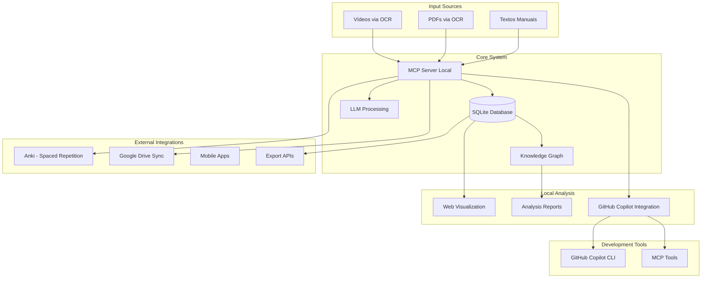
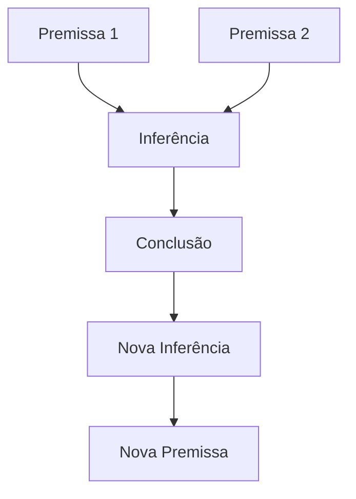

## Visão Geral

O Muleta Cognitiva é um sistema open-source de aprendizado pessoal que utiliza grafos de conhecimento para mapear, organizar e otimizar a retenção de informações extraídas de diferentes fontes (vídeos, textos, PDFs). O sistema funciona como uma fonte de dados rica que alimenta plataformas externas especializadas, enquanto oferece análise local via MCP (Model Context Protocol) server.

## Arquitetura Geral



## Features Principais

### 1. Extração e Processamento de Conteúdo

**Video-to-Text OCR** ([video_to_text.sh](../video_to_text.sh))
- Extração automática de frames de vídeos
- OCR com Tesseract (português + inglês)
- Detecção de cenas para otimizar extração
- Saída estruturada em diretórios organizados

**Processamento via LLM**
- Identificação automática de entidades e conceitos
- Extração de relações semânticas entre conceitos
- Geração de observações estruturadas
- Classificação automática por tipo/categoria

### 2. Grafo de Conhecimento

**Estrutura de Dados** (memory)
- Entidades: conceitos, pessoas, teorias, métodos
- Relações: conexões semânticas tipificadas
- Observações: notas detalhadas por entidade
- Metadados: fontes, timestamps, confiabilidade
- Arquivos: informações detalhadas sobre o tema

**Visualização Interativa** ([index.html](../index.html))
- Grafo de força com ECharts
- Layout circular para visão estrutural
- Diagramas Sankey para fluxo de relações
- Tooltips com observações completas
- Filtros por categoria e tipo de relação

### 3. Sistema de Revisão Espaçada Automatizada

**Integração com Anki**
- Geração automática de flashcards baseada em entidades
- Algoritmo de Ebbinghaus para intervalos de revisão
- Sincronização via API ou export/import
- Métricas de performance e dificuldade

**Cards Inteligentes**
- Perguntas geradas via LLM baseadas no contexto
- Diferentes tipos: definição, relação, aplicação
- Questões socráticas integradas

### 4. Gerador de Questões Socráticas

**Templates Inteligentes**
- "Por que X é importante para Y?"
- "Que evidências sustentam a ideia de X?"
- "Como X se relaciona com Y e Z?"
- "Quais as implicações práticas de X?"
- "Que objeções alguém poderia fazer contra X?"

**Contextualização**
- Questões baseadas nas relações do grafo
- Diferentes níveis de profundidade
- Integração com sistema de revisão
- Tracking de progresso no entendimento

### 5. Sequências Lógicas Argumentativas

**Análise de Argumentação**
- Identificação de premissas, inferências e conclusões
- Mapeamento de conectores lógicos
- Geração de diagramas ECharts para fluxos argumentativos
- Detecção de falácias e gaps lógicos

**Diagramas Visuais**


### 6. Resumos Progressivos

**Wiki Pessoal**
- Resumos automáticos por entidade
- Diferentes níveis: básico, intermediário, avançado
- Atualização incremental com novo conteúdo
- Links para fontes originais e relacionadas

**Estrutura Hierárquica**
- Conceitos → Subcategorias → Detalhes
- Navegação por tags e categorias
- Exportação para diferentes formatos

### 7. Gerador de Avaliações

**Provas Customizadas**
- Questões baseadas em entidades selecionadas
- Múltipla escolha, dissertativas, verdadeiro/falso
- Avaliação automática via LLM
- Feedback detalhado sobre lacunas de conhecimento
- Formatação simples de ser preenchida e avaliada ao ser retornada para a LLM

## Integrações com Sistemas Terceiros

### Anki - Revisão Espaçada
- **Export automático**: Cards em formato .apkg
- **API Integration**: Sync bidirecional via AnkiConnect
- **Métricas**: Import de estatísticas de performance
- **Customização**: Templates baseados no tipo de entidade

### GitHub Copilot
- **MCP Integration**: Servidor local para contexto
- **CLI Support**: Comandos via gh copilot
- **Code Generation**: Assistência no desenvolvimento
- **Documentation**: Geração automática de docs

### Plataformas de Estudo
- **Obsidian**: Export em formato markdown linkado

## Arquitetura Técnica

### MCP Server Local

**Responsabilidades**
- Processamento de novos conteúdos via LLM
- Análise e extração de entidades/relações
- Geração de cards e questões
- Exports e sincronizações automáticas
- Backup e versionamento

**Tools Disponíveis**
```python
# Principais ferramentas MCP
- process_content(source_path, content_type)
- generate_cards(entity_ids, card_type)
- create_assessment(topic_entities, question_types)
- export_to_anki(entity_filter, deck_name)
- analyze_argument_sequence(entity_ids)
- generate_summary(entity_id, complexity_level)
```

### Base de Dados SQLite

**Tabelas Principais**
- `entities`: conceitos e suas classificações
- `relations`: conexões tipificadas entre entidades
- `observations`: notas detalhadas por entidade
- `learning_sessions`: sessões de estudo registradas
- `spaced_repetition_cards`: sistema de revisão
- `assessments`: provas e avaliações geradas
- `argument_sequences`: fluxogramas argumentativos
- `knowledge_gaps`: análise de lacunas

### Interface Web

**Tecnologias**
- Frontend: HTML5 + ECharts + Vanilla JS
- Visualização: Grafos interativos força-direcionada
- Multiple Views: Force-directed, Circular, Sankey
- Responsive: Otimizado para desktop e tablet
- Offline: Service worker para cache local

**Funcionalidades Avançadas**
- Alternância entre tipos de visualização
- Análise de fluxogramas argumentativos
- Dashboard de métricas de aprendizado
- Interface para revisão de cards

## Workflow Típico de Uso

### 1. Ingestão de Conteúdo
1. Usuário processa vídeo: `bash video_to_text.sh -i aula.mp4` ou envia o texto
2. MCP Server analisa texto extraído via LLM
3. Sistema identifica entidades e relações automaticamente
4. Dados são persistidos no SQLite com metadados
5. Visualização web é atualizada automaticamente

### 2. Estudo e Revisão
1. Sistema gera cards de revisão baseados em algoritmo espaçado
2. Cards são exportados para Anki ou interface web
3. Usuário realiza revisões e marca performance
4. Sistema ajusta intervalos baseado no desempenho
5. Métricas são coletadas para análise de progresso

### 3. Avaliação e Gaps
1. Usuário seleciona tópicos para avaliação
2. Sistema gera prova customizada via LLM
3. Respostas são avaliadas automaticamente
4. Relatório identifica lacunas de conhecimento
5. Sugestões de estudo direcionado são geradas

### 4. Análise e Insights
1. Visualização do grafo revela padrões e conexões
2. Relatórios mostram evolução temporal do conhecimento
3. Sequências argumentativas são mapeadas visualmente
4. Resumos progressivos são atualizados incrementalmente

### 5. Desenvolvimento e Manutenção
1. GitHub Copilot CLI assiste na evolução do código
2. MCP tools fornecem contexto para desenvolvimento
3. Documentação é mantida automaticamente
4. Testes são sugeridos baseados no contexto

## Roadmap de Desenvolvimento

### Fase 1: Foundation (MVP) ✅
- Migration script dos dados atuais
- MCP Server básico com SQLite
- Processamento via LLM de novos conteúdos
- Visualização web mantida e aprimorada

### Fase 2: Automation (Em Progresso)
- Sistema de revisão espaçada
- Geração automática de questões
- Export para Anki
- Análise de sequências argumentativas

### Fase 3: Intelligence (Planejado)
- Resumos progressivos automáticos
- Geração de avaliações customizadas
- Métricas avançadas de aprendizado
- Sugestões inteligentes de estudo

### Fase 4: Integration (Futuro)
- APIs REST para terceiros
- Sync com Google Drive
- Mobile app companion
- Plugins para outras plataformas

## Troubleshooting e Configuração

### GitHub Copilot CLI
Para resolver problemas com o GitHub Copilot CLI:

1. **Verificar autenticação**:
```bash
gh auth status
gh copilot auth
```

2. **Instalar/atualizar extensão**:
```bash
gh extension install github/gh-copilot
gh extension upgrade gh-copilot
```

3. **Verificar status do Copilot**:
```bash
gh copilot status
```

### Video to Text Script
Para otimizar o processamento de vídeos:
- Use iluminação uniforme e evite reflexos
- Configure `-f 1` para 1 quadro/segundo em conteúdo estático
- Ajuste `-t 0.25` para sensibilidade de detecção de cena
- Use `--keep-frames` durante testes para debug

## Conclusão

O Muleta Cognitiva representa uma abordagem moderna ao aprendizado pessoal, combinando automação inteligente via LLM com controle local via MCP Server. Ao focar em ser uma fonte rica de dados para alimentar sistemas especializados, o projeto oferece flexibilidade máxima enquanto mantém a privacidade e controle do usuário sobre seu conhecimento.

A arquitetura modular permite evolução incremental, começando com funcionalidades básicas e expandindo conforme necessidades específicas do usuário. A integração nativa com GitHub Copilot via MCP torna o desenvolvimento e manutenção mais eficientes, enquanto a natureza open-source garante transparência e possibilidade de contribuições da comunidade.